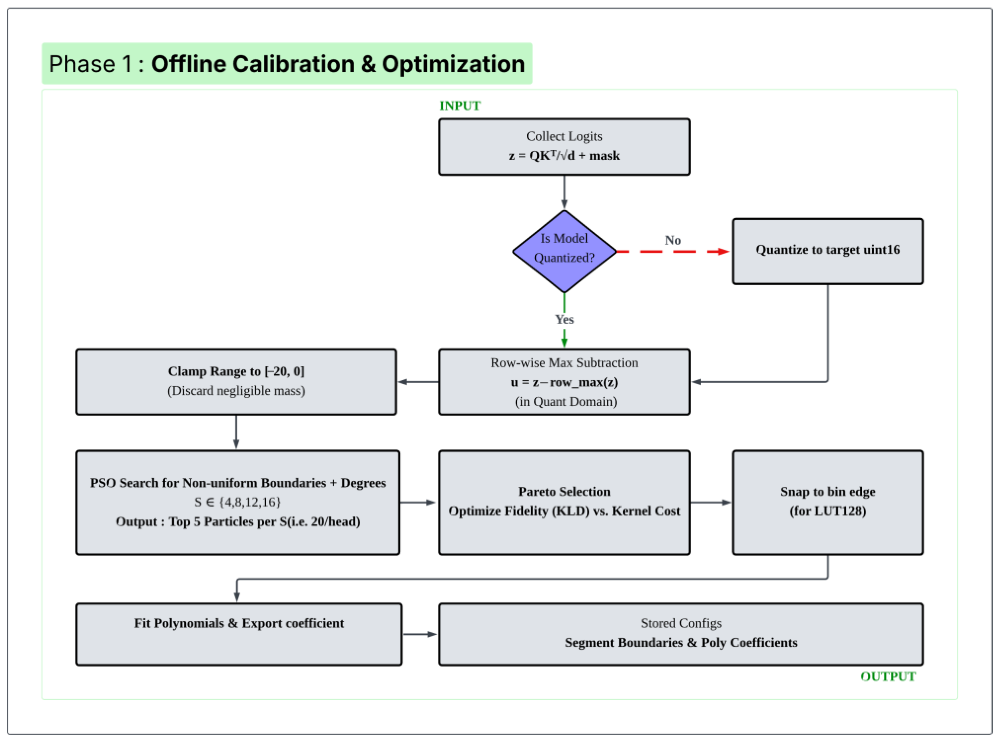
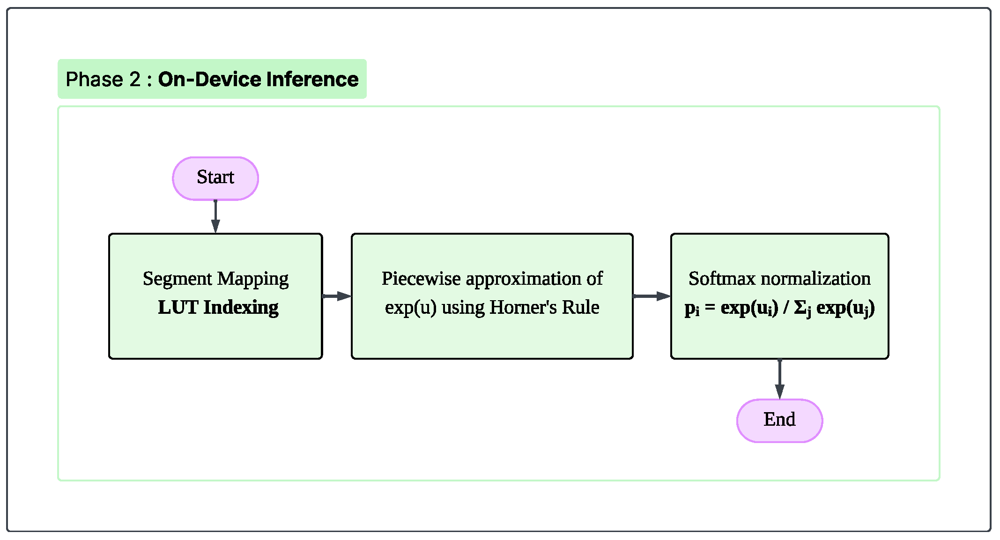
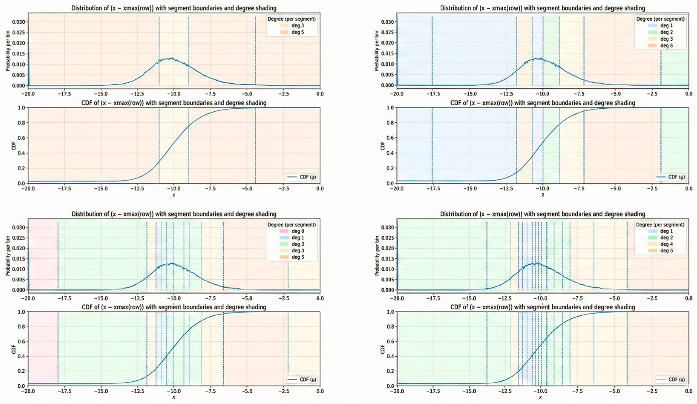
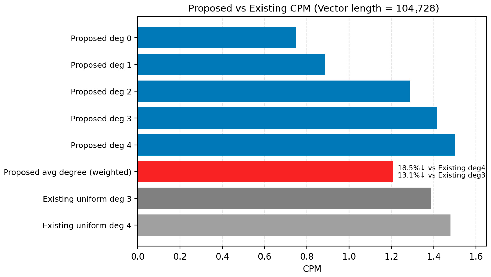

# AIChip-NPU-Softmax

**Attention Distribution-Aware Softmax for NPU-Accelerated On-Device Inference of LLMs: An Edge-Oriented Approximation Design**

Sanoop Sadheerthan, Min-Jie Hsu, Chih-Hsiang Huang, and Yin-Tien Wang

*Electronics* 2026, 15(6), 1312  
DOI: [10.3390/electronics15061312](https://doi.org/10.3390/electronics15061312)

Paper: [MDPI Paper](https://www.mdpi.com/2079-9292/15/6/1312)

This repository is a landing page for the published paper. The work addresses a practical deployment problem in edge LLM inference: low-power NPUs are efficient at integer and fixed-point tensor algebra, but they typically do not provide native exponential support, making softmax a repeated runtime bottleneck inside Transformer attention.

## Overview

Existing hardware-aware softmax approximations usually choose one of two extremes. Uniform piecewise polynomial designs preserve constant-time indexing, but they spend the same arithmetic budget everywhere, even where attention probabilities are negligible. Fully adaptive approximations better match real attention statistics, but they often depend on comparator-heavy boundary search, BST traversal, or architectural support that is awkward to integrate into existing NPU inference paths.

AIChip-NPU-Softmax targets the gap between those two approaches. The method learns per-head non-uniform segments and per-segment polynomial degrees with Particle Swarm Optimization (PSO), then snaps the learned boundaries onto a LUT128 grid so the final kernel keeps O(1), branch-free indexing while still following the observed attention distribution.

## Experimental Setup

The experiments were conducted with the following host, target, and benchmarking software environment.

### Host

- **OS:** Ubuntu 22.04
- **RAM:** 128 GB
- **CPU:** AMD Ryzen 9 7900X3D 12-Core Processor

### Target

- **Platform:** [Innodisk EXEC-Q911](https://www.innodisk.com/en/products/computing/qualcomm-solution/exec-q911)
- **Chipset:** Qualcomm Dragonwing IQ-9075 SoC (`QCS9075`, IQ9 class)

### Software

- **Benchmarking SDK:** [Hexagon NPU SDK](https://www.qualcomm.com/developer/software/hexagon-npu-sdk) `6.4.0.1`
- **PSO Tool:** [PySwarms](https://pyswarms.readthedocs.io/en/latest/) `1.3.0` for offline boundary and degree optimization. See the paper for additional implementation details.

> **Note**
> Although the reported measurements come from this host and target configuration, the solution itself is generic. The same methodology can be adapted to other integer or fixed-point NPU deployments, but similar results depend on following the full flow accurately: representative logit collection, PSO-based boundary and degree search, LUT128 snap-to-edge quantization, runtime table generation, and branch-free LUT-based inference.

## Workflow

The method is organized into an offline calibration phase and an online inference phase.

### Phase 1: Offline Calibration

Representative forward passes are used to collect stabilized pre-softmax logits, clamp them to `[-20, 0]`, and search head-specific segment boundaries and polynomial degrees with PSO. The selected boundaries are then snapped to LUT-aligned positions and exported together with the polynomial coefficients as compact deployment tables.

### Phase 2: Online Inference

At runtime, each stabilized logit is mapped to a segment with LUT-based O(1) indexing. The selected segment polynomial is then evaluated with fixed-point Horner arithmetic, followed by the usual softmax normalization step, so the inference path remains hardware-friendly.

## Research Focus

The research focus is to make softmax approximation more faithful to real attention behavior without giving up the indexing simplicity required by NPU kernels. In practical terms, this project asks whether a distribution-aware approximation can reduce exponential-kernel cost on device while preserving attention ranking fidelity closely enough for LLM inference.

### Why Distribution-Aware?

After row-wise max subtraction and clamping to `[-20, 0]`, stabilized attention logits are not used uniformly across the domain. They concentrate much more heavily near `0`, which corresponds to the higher-probability region after exponentiation, while the far-negative tail contributes low-probability values. A distribution-aware design therefore allocates denser segments where probability mass matters most and uses coarser treatment in sparse tail regions where exact fidelity is less critical.

### Why Non-Uniform Segments?

Uniform segments with a fixed polynomial degree apply the same resource budget everywhere. That is convenient for hardware, but it wastes multiplies, accumulates, and approximation capacity in low-impact regions. Non-uniform segments let the approximation place resolution where the curve and the workload justify it, while variable per-segment degrees reduce unnecessary arithmetic in regions that can tolerate cheaper evaluation.

### Why LUT128 Indexing?

Non-uniform boundaries are only useful in deployment if the runtime can still select segments cheaply. A direct adaptive implementation would need repeated boundary comparisons, BST traversal, or comparator-heavy control, which disrupts SIMD utilization and adds overhead that is separate from the polynomial itself. LUT128 indexing is required because it converts segment selection into a simple bin index and table lookup, preserving O(1), branch-free behavior that standard integer NPUs can execute efficiently.

### Snap-to-Edge Technique

The snap-to-edge technique quantizes each PSO-optimized boundary to the nearest LUT bin edge on a fixed 128-bin grid over `[-20, 0]`. This keeps most of the learned non-uniform structure, but aligns every boundary to hardware-addressable bin edges so the runtime can use a compact `bin_to_seg` table instead of floating-point boundaries or wide integer comparisons. In practice, snapping is what bridges the gap between an offline statistical optimum and a deployable kernel: it preserves the benefit of learned segmentation while making deterministic indexing possible. The technique also matters for correctness, because the search is constrained to avoid boundaries collapsing into the same LUT bin after quantization.

## Key Features

- **PSO boundary and degree optimization (per head):** The method searches segment boundaries and polynomial degrees independently for each attention head because attention distributions shift across heads and layers.
- **LUT128 boundary quantization:** Learned boundaries are snapped to 128 LUT bin edges with a snap-to-edge scheme, which preserves non-uniform segmentation while enabling O(1), branch-free lookup instead of comparator-based segment search.
- **Weighted low-degree execution:** Runtime usage is dominated by cheaper polynomial orders, so the method converts observed attention skew into lower average compute cost without sacrificing the dominant ranking behavior.

### PSO Behavior

The PSO result below illustrates the central design idea. Around the dense region near `0`, the method uses finer segmentation so lower-degree local polynomials are sufficient, instead of paying a uniformly higher polynomial degree across the full domain. In the sparse negative tail, the segmentation becomes coarser because that region contributes much less probability mass.

## Results

The published evaluation uses TinyLlama-1.1B-Chat as the testbed and reports on-device kernel benchmarking on Qualcomm Dragonwing IQ9 with Hexagon HTP v73. The headline result is that the proposed design reduces exp-kernel runtime cost by **18.5%** versus a uniform 16-segment Degree-4 baseline and **13.1%** versus a uniform 16-segment Degree-3 baseline, while improving throughput by up to **30.9%** and preserving **Top-1 attention rank fidelity of 1.0000 across all 704 heads**.

### Runtime Efficiency

Cost-per-member (CPM) below is derived from published on-device CPC values divided by vector length `N`.

| Vector Length (N) | Proposed CPM | Uniform deg-3 CPM | Uniform deg-4 CPM | Delta vs. deg-3 | Delta vs. deg-4 |
| --- | ---: | ---: | ---: | ---: | ---: |
| 27,296 | 1.132 | 1.325 | 1.393 | -14.6% | -18.8% |
| 60,128 | 0.809 | 0.924 | 1.001 | -12.5% | -19.2% |
| 104,728 | 1.207 | 1.389 | 1.480 | -13.1% | -18.5% |

At the largest benchmark point, the summary cost plot makes the trade-off visually clear: the weighted proposed design stays below the uniform Degree-3 and Degree-4 baselines because the runtime is dominated by lower-degree segments rather than a fixed high-degree polynomial everywhere.

### Throughput (MPS)

| Vector Length (N) | Proposed Weighted avg MPS | Uniform deg-3 MPS | Uniform deg-4 MPS | Gain vs. deg-3 | Gain vs. deg-4 |
| --- | ---: | ---: | ---: | ---: | ---: |
| 27,296 | 0.0502 | 0.0404 | 0.0383 | +24.1% | +30.9% |
| 60,128 | 0.0317 | 0.0263 | 0.0242 | +20.4% | +30.8% |
| 104,728 | 0.0120 | 0.0099 | 0.0092 | +20.8% | +30.0% |

During a forward pass, most exp evaluations fall into low-to-mid polynomial degrees: `deg2` accounts for `35.50%`, `deg3` for `26.77%`, and `deg0 + deg1` together for `28.65%`, while `deg4` and `deg5` are relatively rare at `6.80%` and `2.28%`. This is the practical reason the weighted design outperforms uniform baselines: it does not pay a globally fixed high-degree cost for every element.

### Fidelity

The approximation preserves the dominant attention behavior closely. Top-1 agreement remains `1.0000` across all `704` heads, and the proposed Top-k = 50 overlap still reaches `0.9959375` at p50 and `0.9996875` at p99 even though KL divergence is more sensitive to low-probability tail discrepancies. The reported perplexity changes only from `7.09042` for the gold softmax to `7.09827` for the proposed weighted approximation.

### LUT128 Deployment Advantage

The LUT128 mapping is not only a storage trick; it is a runtime indexing strategy. At `N = 104,728`, LUT128 indexing achieves a **1.88x speedup** and **46.87% CPC reduction** relative to BST-based boundary search for segment selection overhead, showing why snapped non-uniform boundaries are more deployable than adaptive schemes that rely on repeated comparisons.

## Citation

If this research is useful to your work, please cite the paper.

**MDPI and ACS Style**  
Sadheerthan, S.; Hsu, M.-J.; Huang, C.-H.; Wang, Y.-T. Attention Distribution-Aware Softmax for NPU-Accelerated On-Device Inference of LLMs: An Edge-Oriented Approximation Design. Electronics 2026, 15, 1312. https://doi.org/10.3390/electronics15061312

**AMA Style**  
Sadheerthan S, Hsu M-J, Huang C-H, Wang Y-T. Attention Distribution-Aware Softmax for NPU-Accelerated On-Device Inference of LLMs: An Edge-Oriented Approximation Design. Electronics. 2026; 15(6):1312. https://doi.org/10.3390/electronics15061312

**Chicago/Turabian Style**  
Sadheerthan, Sanoop, Min-Jie Hsu, Chih-Hsiang Huang, and Yin-Tien Wang. 2026. "Attention Distribution-Aware Softmax for NPU-Accelerated On-Device Inference of LLMs: An Edge-Oriented Approximation Design" Electronics 15, no. 6: 1312. https://doi.org/10.3390/electronics15061312

**APA Style**  
Sadheerthan, S., Hsu, M.-J., Huang, C.-H., & Wang, Y.-T. (2026). Attention Distribution-Aware Softmax for NPU-Accelerated On-Device Inference of LLMs: An Edge-Oriented Approximation Design. Electronics, 15(6), 1312. https://doi.org/10.3390/electronics15061312

## Access and License Note

The published article is open access under the MDPI **CC BY 4.0** license. Repository licensing is defined separately in [LICENSE](./LICENSE).
