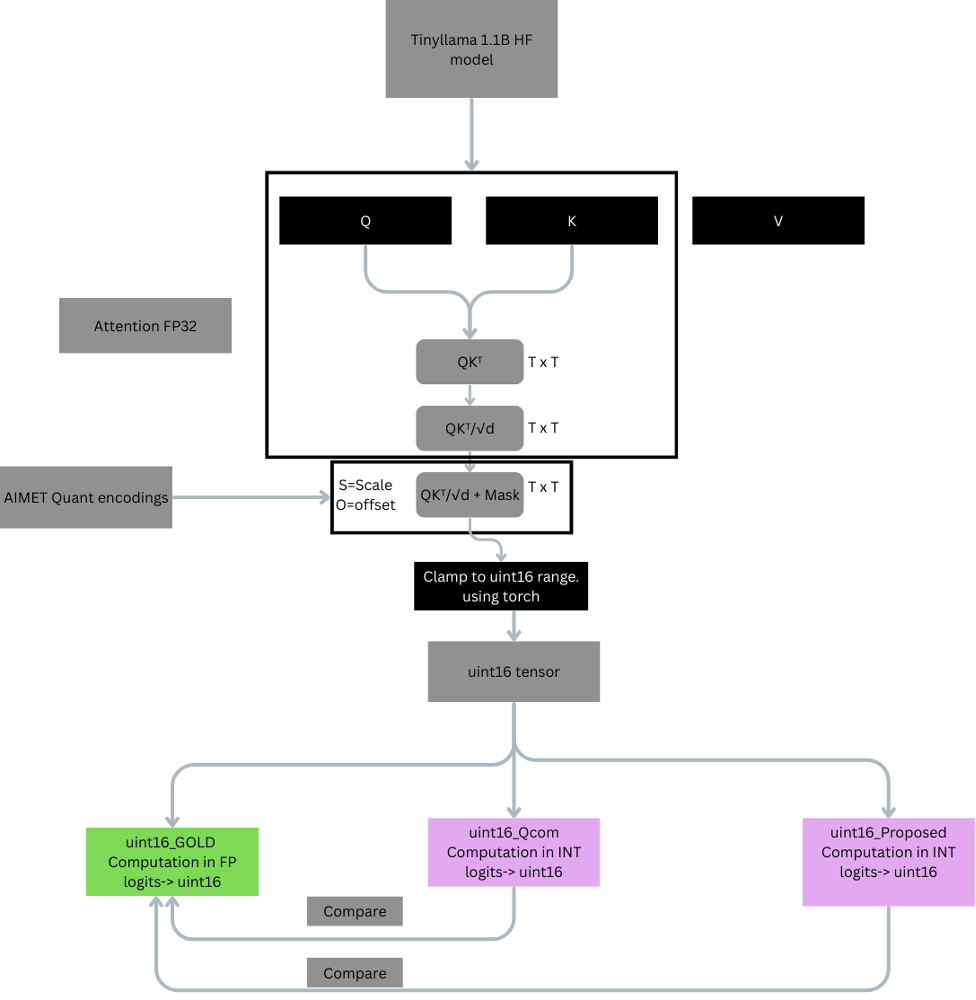

# AIChip-NPU-Softmax Workflow Guide

This directory is the reproducible workflow workspace for collecting attention logits, running PSO, snapping boundaries to LUT128, generating deployment coefficients, and evaluating the result with emulation.

All commands below assume:

```bash
cd code
```

## Layout

```text
code/
├── README.md
├── requirements.txt
├── configs/
│   └── encodings/
│       └── tinyllama.encodings
└── scripts/
    ├── collector/
    │   └── softmax_input_collector.py
    ├── emulation/
    │   ├── emulation_perplexity.py
    │   └── emulation_softmax_metrics.py
    └── pso/
        ├── pso_batch_runner.py
        ├── pso_build_coeff_bank_lut128.py
        ├── pso_fitness_eval.py
        ├── pso_optimize.py
        ├── pso_select_pareto.py
        └── pso_snap_lut128.py
```

Generated outputs are written to `code/workdir/`. That directory is intentionally gitignored.

## Prerequisites

Install the Python dependencies from the repository root:

```bash
python3 -m pip install -r code/requirements.txt
```

Install Git LFS before cloning or pulling this repository so `configs/encodings/tinyllama.encodings` is fetched correctly:

```bash
brew install git-lfs
git lfs install
git lfs pull
```

You will also need:

- a Hugging Face model checkpoint for the `--model` argument
- prompts or text samples for the collector
- generated `add2_u16.bin` captures from the collector for PSO
- internet or cached access for model and dataset downloads used by the emulation steps

## Encoding Note

The bundled file `configs/encodings/tinyllama.encodings` was generated using Qualcomm's AIMET tooling for TinyLlama. It is model-specific.

For other LLMs, generate a matching activation encoding file with the AIMET library and pass that file through `--encoding-json`. Do not reuse the TinyLlama encoding for a different model.

## Emulation Setup



The emulation scripts below assume the same style of quantized activation flow shown above: model-specific encodings, captured attention logits, and a generated coefficient bank.

## Output Directory Map

```text
workdir/
├── collector/
│   ├── bins/
│   ├── plots/
│   └── collector_spec.json
├── pso_runs/
├── pareto/
├── lut128/
├── coeff_banks/
├── emulation_metrics/
└── perplexity/
```

## 1. Collect Softmax Inputs

**Inputs**

- `--model`: the Hugging Face model to inspect
- `--encoding-json`: `configs/encodings/tinyllama.encodings` or another AIMET-generated encoding file
- prompts via `--prompt`, `--prompt-file`, or `--prompt-list`

**Command**

```bash
python3 scripts/collector/softmax_input_collector.py \
  --model TinyLlama/TinyLlama-1.1B-Chat-v1.0 \
  --encoding-json configs/encodings/tinyllama.encodings \
  --outdir workdir/collector \
  --context-len 2048 \
  --chunk-len 128 \
  --prompt-list /path/to/prompts.txt \
  --mode pad \
  --save-u16 \
  --save-samples 0 \
  --save-layers 0-21 \
  --save-heads 0-31
```

**Outputs**

- `workdir/collector/bins/sample0000/layerYY_headZZ_add2_u16.bin`
- `workdir/collector/plots/layerYY_hist_cdf.png`
- `workdir/collector/plots/layerYY_boxplot.png`
- `workdir/collector/plots/layerYY_clip_stats.json`
- `workdir/collector/collector_spec.json`

**Notes**

- `--save-samples`, `--save-layers`, and `--save-heads` let you limit capture size.
- Omit `--save-u16` if you only want plots and clipping statistics.

## 2. Run PSO

**Inputs**

- collector output directory such as `workdir/collector/bins/sample0000`
- the matching encoding JSON

**Command**

```bash
python3 scripts/pso/pso_batch_runner.py \
  --input-dir workdir/collector/bins/sample0000 \
  --pso-script scripts/pso/pso_optimize.py \
  --encoding-json configs/encodings/tinyllama.encodings \
  --layers 0-21 \
  --heads 0-31 \
  --segments 16,12,8,4 \
  --out-dir workdir/pso_runs \
  --tag tinyllama_lut128
```

**Outputs**

- `workdir/pso_runs/PSO_tinyllama_lut128.json`
- `workdir/pso_runs/per_run/Sxx/tinyllama_lut128/Lxx_Hyy_Szz.json`
- `workdir/pso_runs/logs/tinyllama_lut128__<timestamp>/...`

**Notes**

- `pso_batch_runner.py` is the main batch workflow.
- `pso_optimize.py` can still be run directly for one `(layer, head, segments)` experiment when needed.

## 3. Pick Pareto Solutions

**Inputs**

- the PSO summary JSON from step 2

**Command**

```bash
python3 scripts/pso/pso_select_pareto.py \
  --in_json workdir/pso_runs/PSO_tinyllama_lut128.json \
  --kl_key kl_p95_u16 \
  --kl_thr 0.001 \
  --segments S04,S08,S12,S16 \
  --out_json workdir/pareto/selected_pareto.json \
  --out_csv workdir/pareto/selected_pareto.csv \
  --dump_pareto_json workdir/pareto/pareto_fronts.json
```

**Outputs**

- `workdir/pareto/selected_pareto.json`
- `workdir/pareto/selected_pareto.csv`
- `workdir/pareto/pareto_fronts.json`

**Notes**

- The selected JSON is the input to LUT128 snapping.
- The CSV is useful for quick filtering and review outside the JSON tree.

## 4. Snap Boundaries To LUT128

**Inputs**

- `workdir/pareto/selected_pareto.json`

**Command**

```bash
python3 scripts/pso/pso_snap_lut128.py \
  --in_json workdir/pareto/selected_pareto.json \
  --out_json workdir/lut128/selected_pareto_lut128.json \
  --out_csv workdir/lut128/selected_pareto_lut128_debug.csv \
  --bins 128 \
  --xmin -20 \
  --xmax 0 \
  --fix_endpoints
```

**Outputs**

- `workdir/lut128/selected_pareto_lut128.json`
- `workdir/lut128/selected_pareto_lut128_debug.csv`

**Notes**

- The JSON contains the snapped boundaries used by the LUT-aware coefficient generator.
- The CSV contains diagnostics for collisions, moves, and skipped cases.

## 5. Generate Coeff Banks

**Inputs**

- `workdir/lut128/selected_pareto_lut128.json`

**Command**

```bash
python3 scripts/pso/pso_build_coeff_bank_lut128.py \
  --selected_json workdir/lut128/selected_pareto_lut128.json \
  --out workdir/coeff_banks/coeffs_q31_all_LH_lut128.json \
  --boundary_key auto
```

**Outputs**

- `workdir/coeff_banks/coeffs_q31_all_LH_lut128.json`

**Notes**

- This is the coefficient bank consumed by the emulation scripts.
- The repo keeps only the LUT-aware snapped flow; there is no bundled unsnapped bank path.

## 6. Run Emulation-Based Accuracy Metrics

**Inputs**

- `configs/encodings/tinyllama.encodings`
- `workdir/coeff_banks/coeffs_q31_all_LH_lut128.json`
- the model checkpoint referenced by `--model`

**Command**

```bash
python3 scripts/emulation/emulation_softmax_metrics.py \
  --model TinyLlama/TinyLlama-1.1B-Chat-v1.0 \
  --encoding-json configs/encodings/tinyllama.encodings \
  --methods qcom,qcom3,my \
  --my-approx-json workdir/coeff_banks/coeffs_q31_all_LH_lut128.json \
  --context-len 2048 \
  --chunk-len 128 \
  --device cpu \
  --topk 5 \
  --outdir workdir/emulation_metrics
```

**Outputs**

- `workdir/emulation_metrics/compare_metrics.csv`
- `workdir/emulation_metrics/softmax_spec.json`

**Notes**

- `compare_metrics.csv` contains the per-layer, per-head accuracy breakdown.
- Use `--methods qcom,qcom3,my` to compare the LUT-aware bank against the reference baselines.

## 7. Run Perplexity Evaluation

**Inputs**

- `configs/encodings/tinyllama.encodings`
- `workdir/coeff_banks/coeffs_q31_all_LH_lut128.json`
- the model checkpoint referenced by `--model`

**Command**

```bash
python3 scripts/emulation/emulation_perplexity.py \
  --model TinyLlama/TinyLlama-1.1B-Chat-v1.0 \
  --encoding-json configs/encodings/tinyllama.encodings \
  --my-approx-json workdir/coeff_banks/coeffs_q31_all_LH_lut128.json \
  --methods fp,qcom,qcom3,my \
  --device cuda \
  --dtype fp16 \
  --context-len 2048 \
  --chunk-len 128 \
  --max-tokens 200000 \
  --max-windows 200 \
  --outdir workdir/perplexity \
  --save-csv
```

**Outputs**

- `workdir/perplexity/ppl_summary.csv`
- `workdir/perplexity/ppl_windows_<method>.csv` when `--save-csv` is enabled

**Notes**

- The first run may download Wikitext2 through `datasets` if it is not already cached.
- Use `--device cpu` or `--no-autocast` if your environment does not support the default GPU path.

## Troubleshooting

- If a script complains about missing dependencies, reinstall with `python3 -m pip install -r code/requirements.txt`.
- If PSO finds no jobs, verify that collector outputs exist under `workdir/collector/bins/sampleXXXX/` and follow the expected `layerYY_headZZ_add2_u16.bin` naming.
- If emulation fails with missing model or dataset assets, confirm the Hugging Face model can be resolved in your environment.
